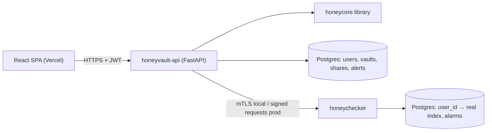

# PROJECT BRIEF — HoneyVault (Team Ocean's 10)

Course: Cryptography & Network Security (CE305/CS305), SPIT Mumbai — ACNS-DC 2026-27.
This file is the single source of truth for **what** we build and **why**. §7–§10 are
**normative**: implementations must match them exactly.

## 1. One-liner
A password vault where decryption never fails: every wrong master password yields a statistically
plausible decoy vault, so a stolen vault file gives an offline attacker no way to confirm a guess.
Extended with honeywords breach detection, ECC-based secure sharing, and a small PKI.

## 2. Problem
Vaults derive a key from a master password (PBKDF2/Argon2) and encrypt with AES. Once the vault
file is stolen, the attacker guesses offline with no rate limit, and the format itself confirms
success (valid JSON / MAC / padding). This *verification oracle* makes cracking human-chosen
passwords tractable because real password distributions are highly skewed.

## 3. Significance
LastPass 2022: encrypted vault backups of 25M+ users were exfiltrated. Researchers later linked
150+ victims to >$35M in losses from vaults cracked offline (crypto seed phrases were common).
That led to a $24.5M settlement and a UK ICO penalty. The security of a conventional vault after
theft equals the strength of a human-memorised password, whatever the AES key length.

## 4. Prior work & gap
| Approach | Idea | Limitation |
|---|---|---|
| Conventional vault (LastPass, KeePass) | KDF → AES-GCM/CBC | Offline success/failure oracle |
| Kamouflage (Boyen, Bonneau, Boneh) | Store decoy vaults | Decoys derived from real password leak structure |
| Honey Encryption (Juels & Ristenpart 2014) | DTE + cipher, every key → plausible message; MR-security bound | Theoretical; needs an accurate message model |
| NoCrack (Chatterjee et al. 2015) | Natural-language encoders (PCFG/n-gram) for vaults | Research prototype; typo-tolerance open |

**Our gap:** a working, evaluable HE vault scoped to credential entries, with an evaluation
harness and a network-security layer (honeywords server, ECC sharing, PKI/TLS) the papers lack.

## 5. Solution overview
A **Distribution-Transforming Encoder (DTE)** maps each real entry to a uniformly random-looking
**seed**. The seed (not the message) is XORed with an AES-CTR keystream derived via Argon2id.
- Correct password → correct seed → real entry.
- Wrong password → different seed → different but plausible entry.

There is no error state.

## 6. Components (mapped to our submitted design)
1. Distribution model — PCFG trained on a public password corpus (RockYou) + username model.
2. DTE encode/decode — `honeycore/dte/`.
3. KDF — Argon2id (`honeycore/kdf.py`).
4. Stream cipher — AES-256-CTR, **no MAC** (`honeycore/cipher.py`).
5. Vault application — FastAPI + React CRUD vault.
6. Attacker/evaluation module — dictionary attack vs honey and conventional vault; chi-squared;
   classifier.
7. Extensions — honeywords server + honeychecker; ECDH/ECDSA secure sharing; PKI + mTLS/signed
   service channel.



## 7. Cryptographic design (NORMATIVE)

### 7.0 Library contract (`backend/honeycore/interfaces.py`, frozen in Phase 0)
```python
from __future__ import annotations
from dataclasses import dataclass, field
from typing import Protocol, runtime_checkable

# ---- format constants (v1) ----
FORMAT_VERSION = 1
MAX_FIELD_LEN = 32                 # max chars for username and password
PRINTABLE_MIN, PRINTABLE_MAX = 0x20, 0x7E
INT_BYTES = 4                      # each DTE choice is one 32-bit big-endian int
PASSWORD_SEED_INTS = 66            # 2 + 2*MAX_FIELD_LEN
USERNAME_SEED_INTS = 67            # 1 (email-domain choice) + 66
ENTRY_SEED_INTS = PASSWORD_SEED_INTS + USERNAME_SEED_INTS   # 133
ENTRY_SEED_LEN = ENTRY_SEED_INTS * INT_BYTES                 # 532 bytes
SALT_LEN = 16
CTR_NONCE_LEN = 16

@dataclass(frozen=True)
class KDFParams:
    time_cost: int
    memory_cost_kib: int
    parallelism: int
    hash_len: int = 32

KDF_PROFILES: dict[str, KDFParams] = {
    "default":     KDFParams(time_cost=3, memory_cost_kib=65536, parallelism=4),
    "server_lite": KDFParams(time_cost=2, memory_cost_kib=19456, parallelism=1),
    "demo":        KDFParams(time_cost=1, memory_cost_kib=8192,  parallelism=1),
}

class HoneyCoreError(Exception): ...
class InvalidInputError(HoneyCoreError): ...      # e.g. field too long / non-printable (input validation only)
class WrongPasswordError(HoneyCoreError): ...     # ONLY raised by ConventionalVault (the baseline)
class InvalidSignatureError(HoneyCoreError): ...  # sharing / PKI verification failures
class EntryNotFoundError(HoneyCoreError, KeyError): ...  # unknown entry id in update/delete/export_entry_seed → 404

@dataclass(frozen=True)
class Entry:
    service: str
    username: str
    password: str

@dataclass(frozen=True)
class DecodedEntry:
    id: str
    service: str
    username: str
    password: str
    created_at: str
    updated_at: str

@dataclass(frozen=True)
class Sigil:
    emojis: tuple[str, str, str]
    color: str                      # "#RRGGBB"

@dataclass(frozen=True)
class UnlockResult:
    entries: list[DecodedEntry]
    sigil: Sigil

@runtime_checkable
class KDF(Protocol):
    def derive(self, password: str, salt: bytes, params: KDFParams) -> bytes: ...

@runtime_checkable
class StreamCipher(Protocol):
    def apply(self, key: bytes, nonce: bytes, data: bytes) -> bytes: ...   # encrypt == decrypt

@runtime_checkable
class FieldDTE(Protocol):
    seed_len: int
    def encode(self, value: str) -> bytes: ...
    def decode(self, seed: bytes) -> str: ...          # TOTAL: never raises for len == seed_len
    def sample(self) -> str: ...                       # decode(random seed)

@runtime_checkable
class PasswordModel(FieldDTE, Protocol):
    def sample_like(self, password: str) -> str: ...   # same template, fresh segments (honeywords)
    def probability(self, password: str) -> float: ... # model probability (eval/strength)

@runtime_checkable
class EntryDTE(Protocol):
    seed_len: int                                       # == ENTRY_SEED_LEN
    def encode(self, username: str, password: str) -> bytes: ...
    def decode(self, seed: bytes) -> tuple[str, str]: ...

@runtime_checkable
class HoneyVaultAPI(Protocol):
    @classmethod
    def new(cls, kdf_profile: str = "default") -> "HoneyVaultAPI": ...
    @classmethod
    def from_dict(cls, data: dict) -> "HoneyVaultAPI": ...
    def to_dict(self) -> dict: ...
    def entry_count(self) -> int: ...
    def add_entry(self, master_password: str, entry: Entry) -> str: ...            # returns id
    def update_entry(self, master_password: str, entry_id: str, entry: Entry) -> None: ...
    def delete_entry(self, entry_id: str) -> None: ...
    def unlock(self, master_password: str) -> UnlockResult: ...                     # NEVER raises
    def export_entry_seed(self, master_password: str, entry_id: str) -> bytes: ...  # for sharing

@runtime_checkable
class ConventionalVaultAPI(Protocol):
    @classmethod
    def new(cls, master_password: str, kdf_profile: str = "default") -> "ConventionalVaultAPI": ...
    @classmethod
    def from_dict(cls, data: dict) -> "ConventionalVaultAPI": ...
    def to_dict(self) -> dict: ...
    def add_entry(self, master_password: str, entry: Entry) -> str: ...
    def unlock(self, master_password: str) -> list[DecodedEntry]: ...  # raises WrongPasswordError

@dataclass(frozen=True)
class IdentityKeys:
    private_pem: bytes
    public_pem: bytes

@runtime_checkable
class SharingAPI(Protocol):
    def generate_identity(self) -> IdentityKeys: ...
    def seal_share(self, seed: bytes, aad: dict, recipient_public_pem: bytes,
                   sender_private_pem: bytes, sender_cert_pem: bytes) -> dict: ...
    def open_share(self, envelope: dict, recipient_private_pem: bytes,
                   trusted_ca_pems: list[bytes]) -> tuple[bytes, dict]: ...   # (seed, aad); raises InvalidSignatureError

@dataclass(frozen=True)
class CertInfo:
    subject_cn: str
    issuer_cn: str
    serial: int
    not_before: str                 # ISO 8601, UTC
    not_after: str                  # ISO 8601, UTC
    fingerprint_sha256: str         # lowercase hex over the DER encoding

@runtime_checkable
class PKIAPI(Protocol):
    def issue_user_certificate(self, username: str, public_pem: bytes, issuer_cert_pem: bytes,
                               issuer_key_pem: bytes, days: int = 365) -> bytes: ...
    def verify_certificate(self, cert_pem: bytes, trusted_ca_pems: list[bytes], *,
                           expected_cn: str | None = None, require_client_auth: bool = False) -> CertInfo: ...
        # raises InvalidSignatureError on bad chain, expiry, CN or EKU mismatch
    def describe(self, cert_pem: bytes) -> CertInfo: ...   # parse only, no verification
```
`honeycore/factory.py` exposes `load_honeycore(impl: "stub" | "real") -> HoneyCore`, a dataclass
with fields `vault_cls`, `conventional_vault_cls`, `entry_dte`, `password_model`, `sharing`,
`pki` (a `PKIAPI`).

### 7.1 Data model & limits
Entry = (service, username, password). **Service is plaintext metadata** (ADR-001).
Username and password: 1–32 printable ASCII chars (0x20–0x7E). Longer or non-printable input
→ `InvalidInputError` → HTTP 422.

### 7.2 Integer codec (`dte/int_codec.py`)
Each probabilistic choice uses one 32-bit int `r`. Given integer weights `w_i` (total `T ≤ 2^31`;
rescale at training time, minimum weight 1) and cumulative sums `cum`:
- **decode:** `i = bisect_right(cum, r % T)`.
- **encode(i):** `lo = cum[i-1]` (or 0), `hi = cum[i]`; `v = lo + randbelow(hi - lo)`;
  `m = (2^32 - 1 - v) // T`; `r = v + T * randbelow(m + 1)`.

So `r` is near-uniform over [0, 2^32), and a random `r` picks `i` with probability ≈ `w_i / T`.
Unused trailing ints in a seed are filled with `secrets.randbits(32)`.

### 7.3 Password PCFG (`dte/pcfg.py`, `dte/password_dte.py`)
- **Parse:** split a password into maximal runs of L (letters), D (digits), S (symbols).
  Template = e.g. `L6D2S1`. Segment = the literal run (case preserved).
- **Train** (`scripts/train_pcfg.py`): on RockYou. Prefer `rockyou-withcount` frequencies;
  otherwise use rank-based Zipf weights `w = 1/rank^0.9`. Use the top 1M lines; keep the top-K
  segments per (class, length) (K = 5000 for L, 2000 for D/S).
  Add a pseudo-terminal `__CHARS__` per (class, length) with weight = max(1, 0.5% of the bucket),
  so any unseen segment can be spelled char by char from that class's unigram distribution.
  Add a top-level path choice `{pcfg: 999, fallback: 1}`.
  The fallback path = length (1..32, learned) + each char from the 95-char printable unigram.
- **Seed layout (66 ints):**
  `[path] [template] then per segment: [vocab-or-__CHARS__] [word | char×n]`, rest random.
  Worst case 2 + 32 + 32 = 66 ints.
- **Encode:** use the PCFG path if the template exists; else the fallback path. Within PCFG, use
  the vocab word if present; else `__CHARS__`.
- `sample_like(pw)`: keep pw's template, sample fresh segments (used for honeywords).
- **Model file:** `honeycore/models/pcfg_password_v1.json.gz`:
  `{"version":1,"kind":"password","max_len":32,"path":{...},"templates":{...},
  "segments":{"L":{"6":{"monkey":123,"__CHARS__":5}}},"unigrams":{"L":{},"D":{},"S":{},"ANY":{}},
  "fallback_lengths":{"1":...}}`

### 7.4 Username model (`dte/username_dte.py`)
- 67 ints: `[email-domain choice]` + 66-int PCFG over the local part.
- Domain categorical: `__NONE__` plus about 30 common domains (gmail.com, yahoo.com, outlook.com, …).
- Trained on a public username list (SecLists xato usernames).
- Model file: `pcfg_username_v1.json.gz`. If `user@domain` has an unknown domain, encode the whole
  string via the PCFG with `__NONE__` (`@` is a symbol).

### 7.5 Entry DTE (`dte/entry_dte.py`)
`seed = username_seed (268 B) || password_seed (264 B)` = 532 bytes = `ENTRY_SEED_LEN`.
- *(Stretch, Phase 3)* A password-reuse choice so decoy vaults show realistic reuse. This needs a
  `contract-change` PR.

### 7.6 KDF (`kdf.py`)
`argon2.low_level.hash_secret_raw(secret, salt, time_cost, memory_cost, parallelism, hash_len=32,
type=Type.ID)`. The profile used is stored in the vault blob.
- New vaults use `VAULT_KDF_PROFILE`.
- Honeywords use `server_lite`.
- Attack-demo vaults use `demo`.

Key schedule from `K = Argon2id(master, salt)`:
- `enc_key = HMAC-SHA256(K, b"honeyvault-enc-v1")`
- `sigil_key = HMAC-SHA256(K, b"honeyvault-sigil-v1")`

### 7.7 Cipher (`cipher.py`)
AES-256-CTR (`cryptography`), random 16-byte nonce **per entry**, `ct = seed XOR keystream`.
**No MAC/tag/padding.**

### 7.8 Vault blob v1 (the "file" an attacker steals; stored as JSON in DB)
```json
{"format":"honeyvault","version":1,"scheme":"HE-PCFG-v1/AES-256-CTR/argon2id",
 "kdf":{"alg":"argon2id","profile":"default","salt":"<b64 16B>","time_cost":3,
        "memory_cost_kib":65536,"parallelism":4,"hash_len":32},
 "dte":{"password_model":"pcfg-password-v1","username_model":"pcfg-username-v1","entry_seed_len":532},
 "entries":[{"id":"<uuid4>","service":"github.com","nonce":"<b64 16B>",
             "ciphertext":"<b64 532B>","created_at":"<ISO8601>","updated_at":"<ISO8601>"}]}
```
- **unlock(pw):** derive `enc_key` once; for each entry, `seed = CTR(enc_key, nonce) ⊕ ct`;
  `(u, p) = EntryDTE.decode(seed)`. Return the entries plus the sigil.
- **add/update(pw, entry):** encrypt only that entry under `enc_key(pw)`. Never re-encrypt other
  entries. A typo therefore damages at most one entry.

### 7.9 Vault Sigil (`sigil.py`)
`h = HMAC-SHA256(sigil_key, b"sigil")`:
- emojis = `EMOJI64[h[0]%64]`, `EMOJI64[h[1]%64]`, `EMOJI64[h[2]%64]`
- color = `PALETTE16[h[3]%16]`

Nothing is stored. Users learn to recognise their own sigil, and a different one signals a typo.

### 7.10 Baseline conventional vault (`baseline.py`)
Argon2id (same profiles) → AES-256-GCM over the JSON entry list, random 12-byte nonce.
A wrong password raises `WrongPasswordError` (InvalidTag). Used only for the comparison.

## 8. Honeywords + honeychecker (Juels & Rivest 2013)
- **Registration:** take `{username, login_password, master_password}`. Reject if the two passwords
  are equal (compare_digest).
  - Generate k = `HONEYWORDS_K` (10) sweetwords: the real one, 5 × `password_model.sample_like(real)`,
    and 4 × tail-tweaks (change trailing digits/symbols). Dedupe and shuffle with `secrets`.
  - One per-user salt; store `argon2id_server_lite(sweetword, salt)` for each, in order.
  - Send `(user_id, real_index)` to the honeychecker. The API never stores the index.
- **Login:** `h = hash(pw, salt)` (one Argon2 call). Find `i` where `compare_digest(h, hashes[i])`.
  - None → 401 "Invalid credentials".
  - Found → `honeychecker.check(user_id, i)`.
    - `match: true` → JWT.
    - `match: false` → create an **Alert** (`HONEYWORD_LOGIN`, critical, IP, UA, index) and
      return the **same** 401 (don't tip off the attacker).
  - Honeychecker unreachable → 503 (fail closed).
- **Honeychecker service:** own DB; endpoints `POST /hc/register`, `POST /hc/check`,
  `GET /hc/alarms`, `GET /hc/health`. It logs every mismatch.

## 9. Secure entry sharing
- Each user gets a P-256 identity keypair at registration.
  - Private key wrapped with AES-256-GCM under `KEY_WRAP_SECRET` (server KEK; ADR-006).
  - Public key certified by our Issuing CA (X.509, CN = username, 1-year validity,
    keyUsage = digitalSignature + keyAgreement).
- **Share:** sender gives master_password + entry_id + recipient.
  1. `seed = vault.export_entry_seed()`.
  2. Ephemeral ECDH with the recipient's public key → HKDF-SHA256(salt, info=`honeyvault-share-v1`)
     → AES-256-GCM(seed, aad = canonical JSON of `{sender, recipient, service, share_id, created_at}`).
  3. ECDSA-P256-SHA256 signature over the canonical JSON of the envelope minus `signature`.
  4. Include `sender_cert`.
- **Open:** verify the sender cert chain (Issuing → Root) and that it isn't expired; verify the
  signature; ECDH; decrypt; `EntryDTE.decode(seed)`.
  - If the sender typed a wrong master password, the recipient receives a decoy. That is consistent
    with HE and documented.
- **Envelope:**
  `{"v":1,"alg":"ECIES-P256-HKDF-SHA256-AES256GCM+ECDSA-P256-SHA256","eph_pub":"b64 SPKI DER",
  "salt":"b64","nonce":"b64","ciphertext":"b64","aad":{...},"sender_cert":"PEM","signature":"b64 DER"}`

## 10. PKI & service channel
- **Root CA** (P-256, 10 years) is created offline by `pki/make_root_ca.py`. Its key never leaves
  `pki/out/` and is never deployed.
- Library contract: `PKIAPI` / `CertInfo` in `honeycore/interfaces.py` (§7.0), implemented by
  `honeycore/pki.py` (export `PKI`). Every chain, expiry, CN or EKU failure raises
  `InvalidSignatureError`; the honeychecker uses `verify_certificate(..., expected_cn=...,
  require_client_auth=True)` for the API's client cert.
- **Issuing CA** (5 years, signed by Root) issues:
  - user identity certs (in-app)
  - `honeychecker-server` cert (SAN: localhost, honeychecker)
  - `honeyvault-api` client cert (EKU clientAuth)
- **Transport modes** (`HONEYCHECKER_TRANSPORT` / `HC_TRANSPORT`):
  - `plain` — local development.
  - `mtls` — docker-compose. uvicorn runs with `--ssl-certfile/--ssl-keyfile/--ssl-ca-certs
    --ssl-cert-reqs 2`; httpx uses `cert=(crt, key)` and `verify=root-ca`. The honeychecker checks
    the client CN.
  - `signed` — Render, which terminates TLS at its proxy. Headers: `X-HV-Cert` (b64 PEM client cert),
    `X-HV-Timestamp`, `X-HV-Nonce`, `X-HV-Signature`, where the signature is ECDSA over
    `METHOD\nPATH\nTS\nNONCE\nSHA256(body)`. The honeychecker verifies the chain, CN, EKU,
    |now−ts| ≤ 60 s, and a nonce replay cache (5 min).

## 11. Attack & evaluation (success metrics)
- **Attack simulator** (`attack/simulator.py`): the same wordlist (demo list + real password
  inserted at a random rank) against
  (a) a ConventionalVault: stops at the guess that verifies → "CRACKED at guess #n";
  (b) a HoneyVault: every guess returns a vault; report guesses, time, distinct vaults, samples.
  Demo vaults use the `demo` KDF profile.
- **Round-trip:** 100% `decode(encode(x)) == x` for valid inputs (hypothesis).
  `decode` total on random seeds.
- **Chi-squared:**
  (a) byte/int uniformity of seeds from encoding held-out real passwords (expect p > 0.05);
  (b) template frequencies of decoded random seeds vs the model (goodness of fit).
- **Distinguisher:** logistic regression + random forest on features (length, class counts,
  template log-prob, char entropy), real held-out (20% split not used for training) vs decoys,
  5-fold CV. Target accuracy ≤ 60% (ideal 50%). Report honestly, whatever the number.
- **Performance:** unlock p95 < 1.5 s on the deployed API (tune the KDF profile if needed).
- Output: `eval/results/latest.json` (served at `/api/eval/summary`) + `docs/eval-report.md`.

## 12. Threat model & invariants
- **Attacker A1** steals the DB (vault blobs, honeyword hashes). Goals: recover entries; confirm
  the master password offline.
  - Defence: HE (no oracle). Honeywords: cracking hashes yields k candidates, and using a decoy
    triggers an alarm.
- **Attacker A2** is online. Defence: rate limits, JWT, generic errors.
- **Out of scope:** full server compromise (KEK in env), client malware, multi-snapshot
  correlation.
- **Invariants:** see AGENTS.md §1 (no MAC, unlock never fails, total decode, fixed seed length,
  `secrets` RNG, no secret logging, login ≠ master, compare_digest).

## 13. Trade-offs / limitations (ADRs in `docs/decisions/`)
- ADR-001: services stored in plaintext (like NoCrack and LastPass URLs); decoys share services.
- ADR-002: crypto runs server-side (Python honeycore); client-side WASM is future work.
- ADR-003: separate login and master passwords (otherwise honeywords leak master candidates).
- ADR-004: per-entry AES-CTR, no MAC; typo affects only the entry being written; Sigil for typo
  awareness.
- ADR-005: honeychecker transport — mTLS locally, signed requests on Render.
- ADR-006: identity private keys wrapped with a server KEK (wrapping under either password would
  create an oracle).
- Other limitations:
  - Typo-tolerance is open, as in the literature.
  - Fields are limited to 32 chars.
  - Independent decoy entries don't model password reuse (stretch goal).
  - Ciphertext length reveals the entry count.

## 14. Tech stack
- **Backend:** Python 3.12, FastAPI, Pydantic v2, SQLAlchemy 2, Alembic, argon2-cffi,
  cryptography, PyJWT, slowapi, httpx.
- **Eval:** numpy, scipy, scikit-learn, hypothesis.
- **Frontend:** React + TypeScript + Vite, Tailwind CSS, shadcn/ui, TanStack Query, React Router,
  react-hook-form + zod, recharts, framer-motion, lucide-react, sonner, MSW (mocks).
- **Infra:** Neon Postgres, Render (2 web services), Vercel, Docker Compose, GitHub Actions.
- **UI direction:** dark-first "deep ocean" palette (navy `#0B1220` background, slate surfaces)
  with a **honey amber** accent (`#F5A524`). Inter for UI, JetBrains Mono for keys/ciphertext.
  Subtle glass cards, motion for the decoy-vault stream, light mode supported.

## 15. Deployment
- **Vercel:** `frontend/` (SPA rewrites).
- **Render:** `honeyvault-api` (root `backend/`) and `honeyvault-honeychecker` (root `honeychecker/`),
  free tier.
- **Neon:** databases `honeyvault` and `honeychecker`.
- Free tier sleeps after ~15 min idle, so warm both services before any demo.

## 16. Glossary
- **DTE:** Distribution-Transforming Encoder.
- **Seed:** the DTE output that gets encrypted.
- **PCFG:** probabilistic context-free grammar.
- **Template:** class-run pattern (L6D2).
- **Sweetwords:** the k candidate passwords (1 real + honeywords).
- **Honeychecker:** a separate service knowing only the real index.
- **KEK:** key-encryption key.
- **Sigil:** key-derived emoji fingerprint.

## 17. References
1. Juels & Ristenpart, *Honey Encryption: Security Beyond the Brute-Force Bound*, EUROCRYPT 2014
   (ePrint 2014/155).
2. Chatterjee, Bonneau, Juels, Ristenpart, *Cracking-Resistant Password Vaults using Natural
   Language Encoders*, IEEE S&P 2015.
3. Juels & Rivest, *Honeywords: Making Password-Cracking Detectable*, ACM CCS 2013.
4. Boyen, Bonneau, Boneh, *Kamouflage* (as analysed in [2]).
5. LastPass 2022 data breach (Wikipedia).
6. Krebs, *LastPass: "Horse Gone Barn Bolted" Is Strong Password*, 2023.
7. Stallings, *Cryptography and Network Security*.
8. argon2-cffi, pyca/cryptography, hypothesis documentation.