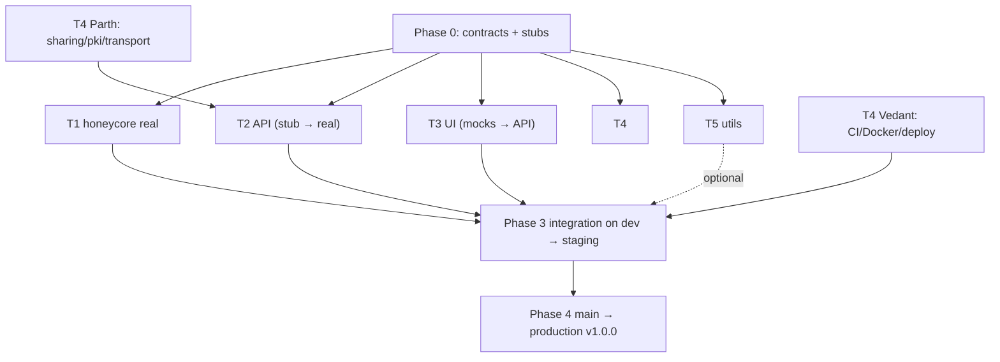

# PROJECT ROADMAP — HoneyVault (Ocean's 10)

Repository: https://github.com/rohansd05/CNS---Honey-Encryption-Vault (admin: Rohan, @rohansd05).
Target submission: **Sun 1 Nov 2026**. Dates are targets; the T1 lead updates this file at each
phase gate.

## 1. Timeline
| Phase | Dates | Goal | Gate (exit criteria) |
|---|---|---|---|
| 0 Foundation | Sat 3 – Mon 5 Oct | Repo, contracts, stubs, everyone set up | Scaffold merged to `dev`; all 10 ran backend locally; every member has merged a PR adding themselves to `docs/TEAM.md` |
| 1 Parallel build | Tue 6 – Sun 12 Oct | Each track builds against stubs/mocks | Track deliverables merged to `dev`, CI green |
| 2 Feature complete | Mon 13 – Sun 19 Oct | Real implementations, stubs swapped out | `HONEYCORE_IMPL=real` works end-to-end locally; staging deployed |
| 3 Convergence | Mon 20 – Sun 25 Oct | Integration, evaluation, e2e flows | All demo flows pass on staging; eval results generated |
| 4 Polish & submit | Mon 26 Oct – Sun 1 Nov | UI polish, docs, report, demo, release | `v1.0.0` tag on `main`, production live, report + demo video submitted |

## 2. Tracks & ownership
| Track | Members | Owns (paths) |
|---|---|---|
| **T1 Core Crypto & DTE** (lead + integration) | Nidhi (DTE/PCFG), Dhruv (KDF/cipher/vault/attack/eval) | `backend/honeycore/` (except sharing/pki/transport), `backend/attack/`, `backend/eval/`, `backend/scripts/download_corpus.py`, `backend/scripts/train_pcfg.py` |
| **T2 Backend API & Honeywords** | Tanuj (app core, auth, vault, attack/eval APIs), Rohan (honeywords, honeychecker, shares, admin) | `backend/app/`, `backend/alembic/`, `honeychecker/` (except `security.py`), `backend/scripts/seed_demo.py` |
| **T3 Frontend** | Krrish (foundation, auth, vault, sharing), Chetan (landing, attacker console, evaluation, admin, about) | `frontend/` |
| **T4 Security Infra & Deployment** | Parth (ECC sharing, PKI, transport security), Vedant (CI, Docker, deploy, release) | `honeycore/sharing.py`, `honeycore/pki.py`, `honeycore/transport.py`, `honeychecker/app/security.py`, `pki/`, `.github/`, Dockerfiles, `docker-compose.yml`, `render.yaml`, `frontend/vercel.json`, `docs/deployment.md`, `backend/scripts/smoke_test.py` |
| **T5 Utilities & Tooling** | Aryan (password-strength utility), Tanmay (attack wordlist builder) | `app/utils/strength.py`, `app/api/utils.py`, `backend/scripts/build_attack_wordlist.py`, `attack/wordlists/` |

### GitHub handles
| Member | Track | GitHub |
|---|---|---|
| Nidhi | T1 (lead) | @Nidzz07 |
| Dhruv | T1 | @dhruvgangurde |
| Tanuj | T2 | @tanujb03 |
| Rohan | T2 · repo admin | @rohansd05 |
| Krrish | T3 | @krrishgadekar |
| Chetan | T3 | @ChetanC09 |
| Parth | T4 | @Pgogg |
| Vedant | T4 · deployment owner | @vedantghuge22-hash |
| Tanmay | T5 | TBD |
| Aryan | T5 | TBD |

**Repo administration** (collaborators, rulesets/branch protection, labels, Project board,
approving the Render/Vercel GitHub app access) belongs to **Rohan**. **Vedant** stays the
deployment owner (CI, Docker, Render/Vercel/Neon projects, releases).

T5 modules are optional enhancements: the app has fallbacks (client-side strength meter, built-in
attack wordlist), and `app/main.py` includes the utils router inside `try/except ImportError`.

### Dependency & convergence map

## 3. Repo structure
See `README.md` → Repository layout. The full tree is maintained in `docs/architecture.md`.

## 4. Frozen contracts (Phase 0)
1. `backend/honeycore/interfaces.py` — PROJECT-BRIEF.md §7.0.
2. Vault blob v1, share envelope v1, PCFG model file format — PROJECT-BRIEF.md §7–§9.
3. REST API — §5 below, expanded in `docs/api-contract.md`.
4. Env var names — `.env.example`.

Changes require a PR labelled `contract-change`, approved by the T1 lead and the affected track(s).

### 4.1 Accepted Phase 0 decisions
Scaffold deviations from the brief, reviewed and accepted by the T1 lead:
1. `interfaces.py` matches §7.0 except: unquoted `HoneyVaultAPI` / `ConventionalVaultAPI` return
   types (ruff UP037), inline comments moved into docstrings, unused `field` import kept with `noqa`.
2. Stub vault blobs have exactly the v1 keys, but `scheme`, `kdf.alg` and model ids say "stub", so
   a stub vault can't be mistaken for a real one.
3. Unknown entry ids raise `EntryNotFoundError` (subclass of `HoneyCoreError` and `KeyError`;
   added by the Phase 0 fix-up, was plain `KeyError`) → HTTP 404.
4. Secret settings are `SecretStr` with empty defaults; read them with `.get_secret_value()`.
5. `honeychecker/pyproject.toml` added (ruff + pytest config) so `pytest` can import `app`.
6. Ruff config marks `alembic` as third-party, plus one `noqa: S105` on the model-path setting.
7. The Alembic `script.py.mako` template uses modern typing so generated migrations pass ruff.
8. `docs/api-contract.md` fills gaps the brief leaves open, marked **(accepted, Phase 0)**: field
   limits, JWT claims, register rate limit, tampered share → 200 with failed flags, 404 for
   unavailable eval/attack routes, honeychecker errors; T2 strips `input`/`ctx` from 422 bodies.
9. `load_honeycore("real")` expects these exports: `vault.HoneyVault`,
   `baseline.ConventionalVault`, `dte.entry_dte.PCFGEntryDTE`, `dte.password_dte.PCFGPasswordModel`,
   `sharing.Sharing`, `pki.PKI` (the last must satisfy `PKIAPI`).

Also: `backend/` and `honeychecker/` both have top-level `app` and `tests` packages, so their test
suites run separately (`cd backend && pytest`; `cd honeychecker && pytest`) — locally and in CI.

## 5. API contract summary (base `/api`, JSON, JWT = `Authorization: Bearer <token>`)
| Method | Path | Auth | Request | Response |
|---|---|---|---|---|
| GET | /health | – | – | `{status, version, honeycore_impl, honeychecker:"ok"\|"down"\|"unknown"}` |
| POST | /auth/register | – | `{username, login_password, master_password}` | 201 `{id, username}`; 409 taken; 422 invalid / login==master |
| POST | /auth/login | – | `{username, login_password}` | 200 `{access_token, token_type:"bearer", user:{id, username, is_admin}}`; 401 `{detail:"Invalid credentials"}`; 503 honeychecker down |
| GET | /auth/me | JWT | – | `{id, username, is_admin, created_at, entry_count}` |
| POST | /vault/unlock | JWT | `{master_password}` | **always 200** `{entries:[{id, service, username, password, created_at, updated_at}], sigil:{emojis:[3], color}}` |
| POST | /vault/entries | JWT | `{master_password, service, username, password}` | 201 `{id}`; 422 field invalid |
| PUT | /vault/entries/{id} | JWT | `{master_password, service, username, password}` | 200 `{id}`; 404 |
| DELETE | /vault/entries/{id} | JWT | – | 204; 404 |
| GET | /vault/export | JWT | – | 200 vault blob v1 (the "stolen file") |
| GET | /users/{username}/identity | JWT | – | `{username, public_key_pem, certificate_pem}` |
| POST | /shares | JWT | `{master_password, entry_id, recipient_username}` | 201 `{share_id}` |
| GET | /shares/inbox | JWT | – | `[{share_id, sender, service, created_at, opened_at}]` |
| GET | /shares/sent | JWT | – | `[{share_id, recipient, service, created_at, opened_at}]` |
| POST | /shares/{id}/open | JWT | – | `{service, username, password, sender, signature_valid, certificate_valid, certificate_subject, certificate_issuer}` |
| GET | /admin/alerts | JWT admin | – | `[{id, username, kind, severity, sweetword_index, source_ip, user_agent, created_at}]` |
| GET | /eval/summary | – | – | contents of `eval/results/latest.json` |
| GET | /attack/stolen-vault | DEMO_MODE | – | `{honey_blob, baseline_blob, owner}` |
| POST | /attack/dictionary | DEMO_MODE | `{max_guesses (≤2000), custom_guesses?: string[]}` | `{baseline:{cracked, guess_index, elapsed_ms, recovered_entries}, honey:{guesses_tried, elapsed_ms, distinct_vaults, samples:[{guess_index, guess, entries}] (≤25)}, reveal:{real_guess_index}}` |
| GET | /attack/stolen-honeywords | DEMO_MODE | – | `{username, k, salt, hashes:[k], cracked_sweetwords:[k]}` |
| GET | /attack/alarms | DEMO_MODE | – | recent alerts for the demo user (attacker-console feedback) |
| POST | /utils/strength | – | `{password}` | `{score:0-4, entropy_bits, feedback:[...]}` (optional, T5) |

Honeychecker (internal): `POST /hc/register {user_id, index}` · `POST /hc/check {user_id, index}
→ {match}` · `GET /hc/alarms` · `GET /hc/health`.

## 6. Git workflow & contribution policy
- Repo: https://github.com/rohansd05/CNS---Honey-Encryption-Vault (admin: Rohan, @rohansd05).
- **AI agents never run git/gh write commands** (add, commit, push, pull, merge, rebase, reset,
  restore, checkout, switch, stash, tag, …; `gh pr/repo/release`). They only edit files and print
  `git status --short` + a suggested commit message; humans commit and push (AGENTS.md §5).
- `main` = released/production. `dev` = integration. Both protected (PR + 1 approval + green CI).
- Feature branches from `dev`: `feat/t<N>-<desc>`. Conventional commits. Small PRs (< ~400 lines).
- Reviewers: the pair partner first; for contract/integration PRs, the T1 lead too.
- Each person commits from their own GitHub account on the files they own (split per §2).
  Pair-programmed commits use `Co-authored-by:` trailers.
- Every PR description lists: what changed, how it was tested, screenshots (UI).
- Weekly sync: Sunday evening integration call (30 min). Daily async stand-up in the group chat:
  done / doing / blocked.

## 7. Phase plans

### Phase 0 — Foundation (3–5 Oct)
- **Rohan (repo admin):** add all 9 collaborators; after the first push, set the default branch to
  `dev`; add rulesets protecting `main` + `dev`; create labels (`t1`…`t5`, `contract-change`, `bug`,
  `integration`); create a GitHub Project board; approve the Render/Vercel GitHub app access when
  Vedant requests it.
- **Nidhi:** commit the root docs + requirements; run the Phase 0 scaffold prompt (backend skeleton,
  `honeycore/interfaces.py`, `stubs.py`, `factory.py`, honeychecker skeleton, `docs/api-contract.md`,
  ADRs, PR template); open a PR to `dev`. **Dhruv** reviews.
- **Everyone:** complete system setup (README / §Setup); run backend + tests locally; open your own
  PR adding your row to `docs/TEAM.md`.

### Phase 1 — Parallel build (6–12 Oct)
**T1**
- Nidhi:
  - `dte/int_codec.py` + tests
  - `scripts/download_corpus.py` (RockYou with counts / SecLists usernames → `data/raw/`)
  - `scripts/train_pcfg.py` → `models/pcfg_password_v1.json.gz`
  - `dte/pcfg.py` + `dte/password_dte.py` (encode/decode/sample/sample_like/probability)
  - hypothesis round-trip + totality tests
- Dhruv:
  - `kdf.py` (Argon2id, profiles)
  - `cipher.py` (AES-256-CTR)
  - `baseline.py` (ConventionalVault, AES-GCM)
  - `vault.py` (HoneyVault per §7.8, dependency-injected DTE, works with the stub DTE first)
  - `sigil.py` hook
  - tests incl. "unlock never raises on 1,000 random passwords"

**T2**
- Tanuj:
  - app factory, settings, DB + Alembic
  - models (`users`, `vaults`, `shares`, `alerts`)
  - register/login/me with JWT
  - vault endpoints via `load_honeycore(settings.honeycore_impl)` (stub)
  - slowapi limits
  - pytest API tests
- Rohan:
  - `services/honeywords.py` (generation via `password_model.sample_like`, per-user salt,
    one-hash login membership check)
  - `honeychecker/` service (DB, `/hc/register`, `/hc/check`, `/hc/alarms`)
  - `services/honeychecker_client.py` (plain mode)
  - login flow wired with alerts; tests incl. "decoy sweetword → 401 + alert"

**T3**
- Krrish:
  - scaffold Vite + React + TS + Tailwind + shadcn/ui
  - design tokens (ocean/honey theme, dark/light), app shell, router, auth context
  - typed API client from the contract
  - MSW mocks for every endpoint
  - Login/Register pages (login ≠ master validation, strength meter with client fallback)
- Chetan:
  - Landing page (hero, "how it works" animated diagram, LastPass story, CTA)
  - About/Team page
  - Attacker Console layout on mocks (3 steps: steal → dictionary attack → honeyword login)

**T4**
- Parth:
  - `pki/` scripts (root CA, issuing CA, service certs)
  - `honeycore/pki.py` (issue user cert, verify chain/expiry/EKU)
  - `honeycore/sharing.py` (§9)
  - `honeycore/transport.py` (sign/verify signed requests)
  - tests (tamper → InvalidSignatureError, wrong CA → fail, expired → fail)
- Vedant:
  - GitHub Actions CI (backend ruff+pytest, honeychecker tests, frontend lint+build when present)
  - Dockerfiles (backend, honeychecker, frontend)
  - `docker-compose.yml` (postgres + api + honeychecker + frontend)
  - Neon project + 2 DBs; Render/Vercel projects linked (no deploy yet; Rohan approves the
    GitHub app access)
  - `docs/deployment.md` draft

**T5**
- Aryan: `app/utils/strength.py` (entropy estimate, common-password check, patterns) + `tests/test_strength.py`.
- Tanmay: `scripts/build_attack_wordlist.py` (top-N from corpus + mangling rules: leet, capitalise,
  append years/digits) + `tests/test_wordlist_builder.py`.

### Phase 2 — Feature complete (13–19 Oct)
**T1**
- Nidhi:
  - `dte/username_dte.py` + username model
  - `dte/entry_dte.py`
  - `sigil.py`
  - `factory.py` "real" wiring
  - `eval/chi_squared.py`
  - publish models; flip default to `HONEYCORE_IMPL=real`
- Dhruv:
  - `attack/simulator.py` + `attack/fallback_wordlist.py`
  - `eval/classifier.py`
  - `eval/run_all.py` → `eval/results/latest.json`
  - performance benchmarks per KDF profile

**T2**
- Tanuj:
  - switch to the real honeycore
  - `/vault/export`, `/attack/*`, `/eval/summary`
  - `scripts/seed_demo.py` (admin, demo user with 8 realistic entries, a second user "bob" for sharing)
  - error handling, OpenAPI matches the contract
- Rohan:
  - identity keys + cert at registration (Parth's libs)
  - `/users/{u}/identity`, `/shares/*`
  - `/admin/alerts`
  - honeychecker client supports `mtls` + `signed` (uses `transport.py`)

**T3**
- Krrish:
  - Vault page (unlock screen with sigil, entries table with reveal/copy, add/edit/delete
    dialogs, auto-lock timer, empty states)
  - Share send dialog + Inbox (signature/cert badges)
- Chetan:
  - Attacker Console full flow with animations (baseline "CRACKED" vs honey decoy stream,
    honeyword-login alarm)
  - Evaluation page (recharts: chi-squared, classifier accuracy, template distributions)
  - Admin Alerts page

**T4**
- Parth: `honeychecker/app/security.py` (mTLS CN check + signed-request middleware, replay cache); compose mTLS verified.
- Vedant: staging deploy (Render api + honeychecker, Vercel preview, Neon), secrets set, CORS, `scripts/smoke_test.py`.

**T5**
- Aryan: `app/api/utils.py` router `POST /api/utils/strength`.
- Tanmay: generate and commit `attack/wordlists/demo_wordlist.txt` (≤ 2,000 lines) + usage section in `docs/`.

### Phase 3 — Convergence (20–25 Oct)
- **Integration day (Mon 20):** all tracks merge to `dev`; frontend `VITE_USE_MOCKS=false`; run the
  §8 checklist together.
- **T1:** full eval run → `docs/eval-report.md`; invariants audit (grep for MAC/log leaks); stretch:
  password-reuse modelling.
- **T2:** e2e API tests for every demo flow; tune KDF profile for Render latency; fail-closed checks.
- **T3:** wire to the real API; loading/error/skeleton states; responsive + accessibility pass.
- **T4:** staging = release candidate; docker-compose mTLS demo recorded; uptime warm-up plan.
- **Bug bash (Sat 24):** everyone tests staging from their own laptop; file issues labelled `bug`.

### Phase 4 — Polish & submit (26 Oct – 1 Nov)
- UI polish, screenshots/GIFs in README, final docs (architecture, threat model, ADRs).
- Report + PPT: each track writes its section (design, implementation, results). T1 lead compiles.
- Demo video (5–7 min) following `docs/demo-script.md`; two rehearsals.
- Vedant: merge `dev` → `main`, production deploy, tag `v1.0.0`, GitHub release notes.

## 8. Convergence checklist (must all pass on staging)
- [ ] Register (login ≠ master enforced) → login → add 5 entries → lock → unlock shows the real vault + the same sigil.
- [ ] Unlock with a wrong master password → plausible decoy vault, different sigil, HTTP 200, similar latency.
- [ ] Export blob → attacker console: baseline cracked at guess #n; honey shows only plausible vaults.
- [ ] Login as demo with a cracked decoy sweetword → 401 + alert visible in Admin and the attacker console.
- [ ] Share alice → bob: bob opens it, signature + certificate valid; tampered envelope rejected.
- [ ] Honeychecker down → login returns 503 (fail closed).
- [ ] Evaluation page shows the latest results; README links to the live app.
- [ ] CI green on `main`; no secrets in the repo (`git log -p | grep -i secret` audit).

## 9. Risk register
| Risk | Mitigation |
|---|---|
| Render free tier slow (0.1 CPU) / cold starts | `server_lite` profile for prod vaults if p95 > 1.5 s; warm services 5 min before demo |
| PCFG training too slow / model too big | Cap to top 1M lines and top-K segments; model ≤ 10 MB gz |
| Classifier accuracy well above 50% | Report honestly; discuss reuse/structure leakage as a limitation; stretch fix |
| Contract drift between tracks | Frozen contracts + MSW mocks + contract-change label |
| A track slips | Stubs/fallbacks keep the app shippable; T1 lead re-plans at each gate |
| mTLS impossible on Render | Signed-request mode in prod, real mTLS in compose (ADR-005) |

## 10. Demo script outline (`docs/demo-script.md`)
1. The problem (LastPass) — 30 s.
2. Normal use: register, add entries, sigil — 60 s.
3. Typo → decoy vault + different sigil — 30 s.
4. Attacker console: stolen blob, baseline cracked vs honey decoy stream — 90 s.
5. Honeyword login → breach alarm — 45 s.
6. Secure sharing with certificate verification — 45 s.
7. Evaluation results + limitations — 60 s.