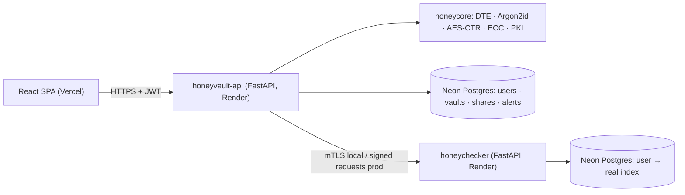

# 🍯 HoneyVault — Honey Encryption Password Vault

> **A stolen vault file should be useless.** HoneyVault uses *Honey Encryption* so every wrong
> master password decrypts to a complete, plausible **decoy vault** — an offline attacker gets
> no signal about which guess, if any, was right.

Built by **Ocean's 10** for *Cryptography & Network Security (CE305/CS305)*,
Applied Cryptography and Network Security Design Challenge (ACNS-DC) 2026-27,
Sardar Patel Institute of Technology, Mumbai.

**Live demo:** _coming soon_ · **API docs:** _coming soon_ · **Report:** `docs/eval-report.md`

---

## Why
In the 2022 LastPass breach, encrypted vaults were stolen and later cracked offline, with losses
exceeding $35M. Conventional vaults (KDF → AES-GCM) hand attackers a perfect *verification
oracle*: the right password yields valid data, wrong ones yield errors. HoneyVault removes that
oracle.

## Features
- **Honey Encryption core** — a PCFG-based Distribution-Transforming Encoder (DTE) trained on a
  public password corpus + **Argon2id** + **AES-256-CTR** with *no MAC*: decryption never fails.
- **Vault Sigil** — a 3-emoji fingerprint of your key, so you notice typos without an oracle.
- **Honeywords + Honeychecker** — the login server stores k sweetwords per user; a separate
  honeychecker raises a **breach alarm** when a decoy password is used.
- **Secure sharing** — share one entry using **ECDH (P-256) + HKDF + AES-GCM**, signed with
  **ECDSA**, with sender identity certified by our own **X.509 CA**.
- **mTLS / signed service channel** between the API and the honeychecker.
- **Attacker Console** — run a dictionary attack on a stolen honey vault vs a conventional
  AES-GCM vault and watch the difference live.
- **Evaluation** — round-trip tests, chi-squared uniformity tests, and an ML distinguisher.

## Architecture


## Quickstart (local)
Prerequisites: Python 3.12, Node 22, Git. (Docker optional, for the mTLS demo.)
```bash
git clone https://github.com/rohansd05/CNS---Honey-Encryption-Vault.git
cd CNS---Honey-Encryption-Vault && cp .env.example .env

# Backend + honeychecker
cd backend && python -m venv .venv && source .venv/bin/activate   # Windows: .venv\Scripts\Activate.ps1
pip install -r requirements-dev.txt -r ../honeychecker/requirements.txt
alembic upgrade head
python scripts/seed_demo.py          # (available from Phase 2)
uvicorn app.main:app --reload --port 8000
# new terminal:  cd honeychecker && uvicorn app.main:app --reload --port 8001

# Frontend
cd frontend && npm install && npm run dev      # http://localhost:5173
```
Full mTLS stack: `docker compose up --build` (see `docs/deployment.md`).

## Tests & evaluation
```bash
cd backend && pytest                 # unit + property + API tests
python -m eval.run_all               # chi-squared, classifier, attack comparison → eval/results/
```

## Repository layout
| Path | What |
|---|---|
| `backend/honeycore/` | Pure crypto library (DTE, KDF, cipher, vault, sharing, PKI) |
| `backend/app/` | FastAPI service (auth, honeywords, vault, sharing, attack demo) |
| `honeychecker/` | Isolated honeychecker microservice |
| `frontend/` | React + TypeScript + Tailwind + shadcn/ui |
| `pki/` | Root/issuing CA and certificate scripts |
| `docs/` | API contract, architecture, ADRs, threat model, evaluation report |

## Team — Ocean's 10
| Track | Members (GitHub) |
|---|---|
| T1 Core Crypto & DTE | Nidhi (@Nidzz07), Dhruv (@dhruvgangurde) |
| T2 Backend API & Honeywords | Tanuj (@tanujb03), Rohan (@rohansd05) |
| T3 Frontend | Krrish (@krrishgadekar), Chetan (@ChetanC09) |
| T4 Security Infra & Deployment | Vedant (@vedantghuge22-hash), Parth (@Pgogg) |
| T5 Utilities & Tooling | Tanmay (TBD), Aryan (TBD) |

## Limitations
Academic prototype — not a production password manager. A mistyped master password silently
shows a decoy vault (typo-tolerance is an open research problem); crypto runs server-side;
cross-vault correlation attacks remain out of scope. See `PROJECT-BRIEF.md` §13.

## References
Juels & Ristenpart, *Honey Encryption*, EUROCRYPT 2014 · Chatterjee et al., *NoCrack*, IEEE S&P
2015 · Juels & Rivest, *Honeywords*, CCS 2013 · Stallings, *Cryptography and Network Security*.

## License
MIT — for academic use.