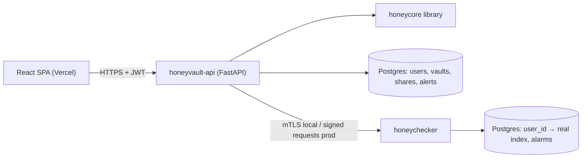

# Architecture

> Owner: T1 lead (Nidhi). Source of truth for the repo tree (PROJECT-ROADMAP.md §3).
> Normative crypto details live in `PROJECT-BRIEF.md` §7–§10.

## 1. System overview


- **honeyvault-api** (`backend/app/`) — auth (JWT + honeywords), vault CRUD, sharing, admin,
  attack demo, evaluation summary. All crypto via `honeycore.factory.load_honeycore(HONEYCORE_IMPL)`.
- **honeycore** (`backend/honeycore/`) — pure library: DTEs (PCFG), Argon2id, AES-256-CTR (no MAC),
  vault blob v1, sigil, baseline vault, ECC sharing, PKI, signed transport. No web/DB imports.
- **honeychecker** (`honeychecker/`) — separate service and DB; knows only `user_id → real index`.
- **frontend** (`frontend/`) — React + TS SPA; MSW mocks until Phase 3.

## 2. Honey-vault data flow
```mermaid
flowchart LR
  E["Entry (username, password)"] -->|EntryDTE.encode| S["seed (532 B)"]
  M["master password"] -->|Argon2id + salt| K["K"]
  K -->|HMAC 'honeyvault-enc-v1'| EK["enc_key"]
  K -->|HMAC 'honeyvault-sigil-v1'| SK["sigil_key"]
  S -->|XOR AES-256-CTR(enc_key, nonce)| C["ciphertext (532 B, no MAC)"]
  SK --> SIG["Sigil: 3 emojis + colour"]
```
Unlock reverses it; any password gives some seed, and `decode` is total, so every password yields
a full vault.

## 3. Stub → real swap
`HONEYCORE_IMPL=stub` (Phase 0–1) loads `honeycore/stubs.py`; `real` (Phase 2+) loads the real
modules lazily and raises `NotImplementedError("<module> not implemented yet — owner: <name>")`
for anything missing. The vault blob shape is identical in both modes.

## 4. Repository tree
Legend: ✅ exists after the Phase 0 scaffold · 🔜 planned (owner, phase).

```text
CNS---Honey-Encryption-Vault/
├── README.md                            ✅
├── PROJECT-BRIEF.md                     ✅ what & why (normative crypto spec)
├── PROJECT-ROADMAP.md                   ✅ who/when, contracts summary
├── CLAUDE.md                            ✅ Claude Code entry point (imports AGENTS.md)
├── .env.example                         ✅ single env file for all services
├── .gitignore                           ✅
├── docker-compose.yml                   🔜 T4 Vedant, P1
├── render.yaml                          🔜 T4 Vedant, P2
├── .claude/
│   └── settings.json                    ✅ agent permissions (denies git/gh write commands)
├── .github/
│   ├── CODEOWNERS                       ✅ review owners per path (PROJECT-ROADMAP.md §2)
│   ├── PULL_REQUEST_TEMPLATE.md         ✅
│   ├── ISSUE_TEMPLATE/task.md           ✅
│   └── workflows/ci.yml                 🔜 T4 Vedant, P1
├── docs/
│   ├── AGENTS.md                        ✅ rules for AI coding agents
│   ├── api-contract.md                  ✅ FROZEN REST contract
│   ├── architecture.md                  ✅ this file
│   ├── threat-model.md                  ✅
│   ├── demo-script.md                   ✅
│   ├── eval-report.md                   ✅ placeholder (T1, P3)
│   ├── TEAM.md                          ✅ everyone adds a row in P0
│   ├── deployment.md                    🔜 T4 Vedant, P1
│   └── decisions/ADR-001…ADR-006.md     ✅
├── backend/
│   ├── pyproject.toml                   ✅ ruff + pytest config
│   ├── requirements.txt                 ✅ runtime
│   ├── requirements-dev.txt             ✅ tests, lint, eval
│   ├── alembic.ini                      ✅
│   ├── alembic/{env.py,script.py.mako,versions/}   ✅ (no migrations yet; T2 Tanuj)
│   ├── Dockerfile                       🔜 T4 Vedant, P1
│   ├── app/                             T2
│   │   ├── main.py · config.py · db.py  ✅
│   │   ├── api/
│   │   │   ├── health.py                ✅
│   │   │   ├── auth.py · vault.py · attack.py · eval.py   ✅ empty routers (Tanuj)
│   │   │   ├── users.py · shares.py · admin.py            ✅ empty routers (Rohan)
│   │   │   └── utils.py                 🔜 T5 Aryan, P2 (optional)
│   │   ├── models/                      ✅ package; users/vaults/shares/alerts 🔜 P1
│   │   ├── schemas/                     ✅ package
│   │   ├── services/                    ✅ package; honeywords.py, honeychecker_client.py 🔜 Rohan P1
│   │   └── utils/                       ✅ package; strength.py 🔜 T5 Aryan P1
│   ├── honeycore/                       T1 (sharing/pki/transport: T4 Parth)
│   │   ├── interfaces.py                ✅ FROZEN contract
│   │   ├── stubs.py · factory.py        ✅
│   │   ├── kdf.py · cipher.py · vault.py · baseline.py    ✅ placeholders (Dhruv, P1)
│   │   ├── sigil.py                     ✅ placeholder (Nidhi, P2)
│   │   ├── sharing.py · pki.py · transport.py             ✅ placeholders (Parth, P1)
│   │   ├── dte/
│   │   │   ├── int_codec.py · pcfg.py · password_dte.py   ✅ placeholders (Nidhi, P1)
│   │   │   └── username_dte.py · entry_dte.py             ✅ placeholders (Nidhi, P2)
│   │   └── models/                      ✅ .gitkeep; pcfg_*_v1.json.gz 🔜 Nidhi P1–P2
│   ├── attack/                          ✅ package (T1 Dhruv)
│   │   ├── simulator.py · fallback_wordlist.py            🔜 Dhruv, P2
│   │   └── wordlists/demo_wordlist.txt  🔜 T5 Tanmay, P2
│   ├── eval/                            ✅ package (T1)
│   │   ├── chi_squared.py               🔜 Nidhi, P2
│   │   ├── classifier.py · run_all.py   🔜 Dhruv, P2
│   │   └── results/latest.json          🔜 generated
│   ├── scripts/                         ✅ package
│   │   ├── download_corpus.py · train_pcfg.py             🔜 T1 Nidhi, P1
│   │   ├── seed_demo.py                 🔜 T2 Tanuj, P2
│   │   ├── build_attack_wordlist.py     🔜 T5 Tanmay, P1
│   │   └── smoke_test.py                🔜 T4 Vedant, P2
│   └── tests/
│       ├── conftest.py · test_health.py ✅
│       ├── core/test_stubs.py           ✅ (T1)
│       ├── api/conftest.py              ✅ (T2)
│       └── infra/conftest.py            ✅ (T4)
├── honeychecker/                        T2 Rohan (security.py: T4 Parth)
│   ├── pyproject.toml · requirements.txt  ✅
│   ├── app/{main,config,db,models,security}.py   ✅ /hc/health only
│   ├── tests/test_health.py             ✅
│   └── Dockerfile                       🔜 T4 Vedant, P1
├── frontend/                            T3 — README.md ✅; Vite app 🔜 Krrish P1
│   └── vercel.json                      🔜 T4 Vedant, P2
├── pki/                                 T4 Parth — README.md ✅; make_root_ca.py etc. 🔜 P1
│   └── out/                             gitignored (keys/certs)
└── data/                                README.md ✅; corpora gitignored
```
